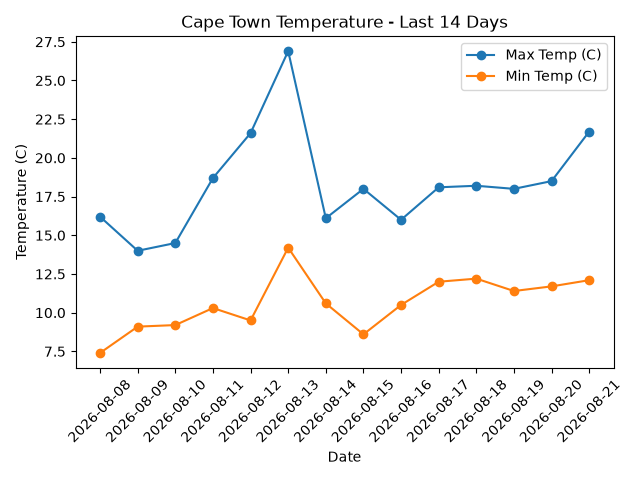

# Weather Data Pipeline

A small ETL (Extract, Transform, Load) pipeline that pulls weather data from a
public API, cleans it, stores it in a database, and visualizes it as a chart.

Built to demonstrate core data engineering concepts (ingestion, transformation,
storage, and serving) using simple, free tools. Designed to be portable to a
platform like Microsoft Fabric later.

## How it works

```
Open-Meteo API → get_weather.py → weather_raw.json
                                        |
                                        v
                clean_weather.py → weather_clean.csv
                                        |
                                        v
                 save_weather.py → weather.db (SQLite)
                                        |
                                        v
                 show_weather.py → weather_chart.png
```

## Steps

1. **Extract** (`get_weather.py`) — downloads the last 14 days of weather data
   for Cape Town from the [Open-Meteo API](https://open-meteo.com/) (no API key
   required) and saves the raw JSON response.
2. **Transform** (`clean_weather.py`) — reads the raw JSON and reshapes it into
   a clean table (date, max temp, min temp, rainfall), saved as a CSV.
3. **Load** (`save_weather.py`) — loads the clean table into a local SQLite
   database.
4. **Serve** (`show_weather.py`) — queries the database and generates a chart
   showing temperature trends over time.

## How to run it

```bash
pip install requests pandas matplotlib

python get_weather.py
python clean_weather.py
python save_weather.py
python show_weather.py
```

This produces `weather_chart.png` — a chart of Cape Town's max/min temperature
over the last 14 days.

## Example output



## Tech used

- Python
- `requests` — API calls
- `pandas` — data cleaning and transformation
- `sqlite3` — local database storage
- `matplotlib` — visualization

## Possible next steps

- Add more cities
- Schedule the pipeline to run daily and build up historical data
- Port the pipeline to Microsoft Fabric (Lakehouse + pipelines) for a
  cloud-native version